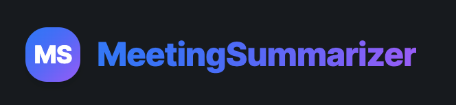

# 🚀 Meeting Summariser AI



> **A premium,full-stack app for summarizing meetings, extracting action items, and analytics.**

---


---

## ✨ Features

- 🔒 **Firebase Authentication** (Google, Email/Password)
- 📄 **Upload Meeting Transcripts** (PDF, DOCX, TXT)
- 🤖 **AI-Powered Summaries** (LLM-generated, 5-bullet insights)
- ✅ **Action Items Extraction & CRUD**
- 📊 **Analytics Dashboard** (keywords, trends, charts)
- 🌗 **Dark & Light Mode** (Apple-style glassmorphism)
- 🖥️ **Modern, Responsive UI** (Inter font, glassy cards, micro-interactions)
- 👤 **User-specific Data**
- ⚡ **FastAPI Backend** (async, production-ready)
- 🛡️ **Secure, Scalable, Extensible**

---

## 🛠️ Tech Stack


---

## ⚡ Quickstart

### 1. Clone & Install

```bash
git clone <your-repo-url>
cd Meeting\ Summariser
npm install
cd backend
python3 -m venv venv
source venv/bin/activate
pip install -r requirements.txt
```

### 2. Firebase Setup

- Create a Firebase project
- Enable Email/Password & Google Auth
- Download `firebase-admin-sdk.json` and place in `backend/`
- Copy your web config to `src/firebase.ts`

### 3. Run Backend (FastAPI)

```bash
cd backend
source venv/bin/activate
export DEVELOPMENT_MODE=true  # or false for prod
uvicorn main:app --reload --port 8001
```

### 4. Run Frontend (Vite + React)

```bash
npm run dev
# Open http://localhost:5173
```

---

## 🔥 API Overview

- `POST /api/meetings` — Upload transcript
- `GET /api/meetings` — List meetings
- `GET /api/meeting/{id}/summary` — Get summary
- `GET /api/meeting/{id}/action-items` — Get action items
- `POST /api/action-items` — Create action item
- `PUT /api/action-items/{id}` — Update action item
- `DELETE /api/action-items/{id}` — Delete action item
- `GET /api/analytics` — Get analytics

> All endpoints require Firebase JWT in `Authorization` header.

---

## 📁 Folder Structure

```
Meeting Summariser/
  backend/           # FastAPI backend
    api/             # API endpoints
    auth/            # Firebase JWT
    models/          # SQLAlchemy models
    services/        # LLM, analytics
    tasks/           # Background workers
    utils/           # Helpers
  src/               # React frontend
    components/      # UI components
    context/         # React context
    pages/           # App pages
    services/        # API calls
    types/           # TypeScript types
```

---

## 🤝 Contributing

1. Fork this repo
2. Create a feature branch (`git checkout -b feature/your-feature`)
3. Commit your changes
4. Push and open a PR

---

## 📜 License

[MIT](./LICENSE)

---

## 🙏 Credits

- [LangChain](https://github.com/langchain-ai/langchain)
- [Firebase](https://firebase.google.com/)
- [FastAPI](https://fastapi.tiangolo.com/)
- [TailwindCSS](https://tailwindcss.com/)
- [Vercel](https://vercel.com/) (for deployment)

---
